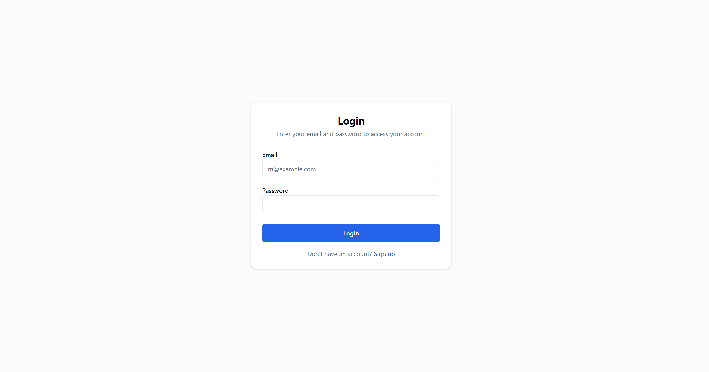
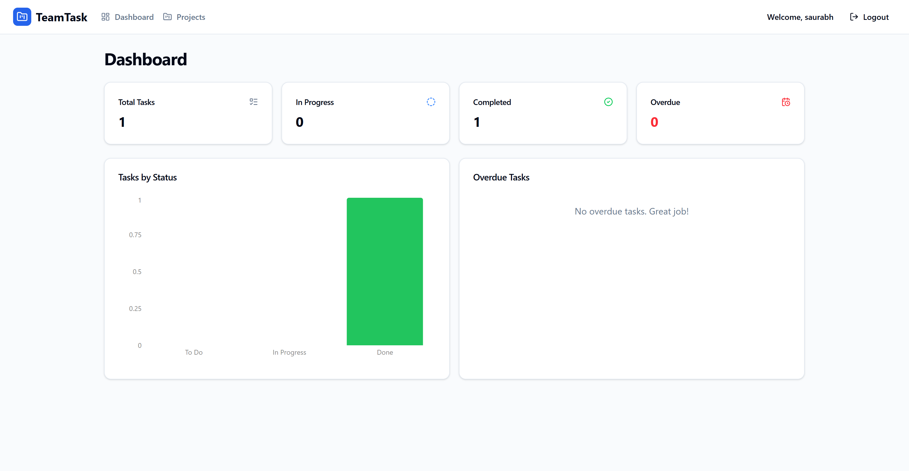
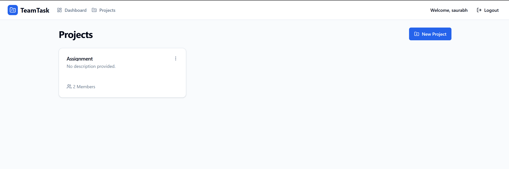
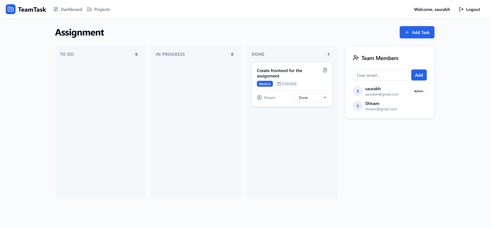

# Team Task Management Web Application

A full-stack, premium MERN (MongoDB, Express, React, Node.js) web application for teams to manage tasks and projects with Role-Based Access Control (RBAC).

## Features
- **Authentication**: JWT-based authentication with Bcrypt password hashing.
- **Role-Based Access Control**: Admins can manage members and tasks; Members can only update the status of their assigned tasks.
- **Projects**: Create and manage multiple projects, add team members by email.
- **Task Kanban Board**: Interactive board with To Do, In Progress, and Done columns.
- **Dashboard**: High-level overview of project tasks with Recharts visualization.
- **Modern UI**: Designed with Tailwind CSS v4 and a premium dark-mode compatible aesthetic.

## Tech Stack
- **Frontend**: React (Vite), Tailwind CSS v4, React Router v6, Axios, Recharts, Lucide Icons.
- **Backend**: Node.js, Express.js, MongoDB (Mongoose), JWT, Bcryptjs.

## Local Setup Instructions

### Prerequisites
- Node.js (v18+ recommended)
- MongoDB instance (local or Atlas)

### 1. Clone the repository and install dependencies
\`\`\`bash
# Install backend dependencies
cd server
npm install

# Install frontend dependencies
cd ../client
npm install
\`\`\`

### 2. Configure Environment Variables
**Backend:** Create a `.env` file in the `/server` directory:
\`\`\`env
PORT=5000
MONGO_URI=your_mongodb_connection_string
JWT_SECRET=your_jwt_secret_key
CLIENT_URL=http://localhost:5173
\`\`\`

**Frontend:** Create a `.env` file in the `/client` directory:
\`\`\`env
VITE_API_URL=http://localhost:5000/api
\`\`\`

### 3. Run the Development Servers
\`\`\`bash
# Start backend (from /server)
npm run dev

# Start frontend (from /client)
npm run dev
\`\`\`
The application will be available at \`http://localhost:5173\`.

## API Documentation
- \`POST /api/auth/register\`: Register a new user.
- \`POST /api/auth/login\`: Authenticate and receive a JWT.
- \`GET /api/projects\`: Get all projects for logged-in user.
- \`POST /api/projects\`: Create a project.
- \`POST /api/projects/:id/members\`: Add a member to a project (Admin only).
- \`GET /api/tasks/project/:id\`: Get tasks for a specific project.
- \`POST /api/tasks\`: Create a new task in a project.

## Screenshots

